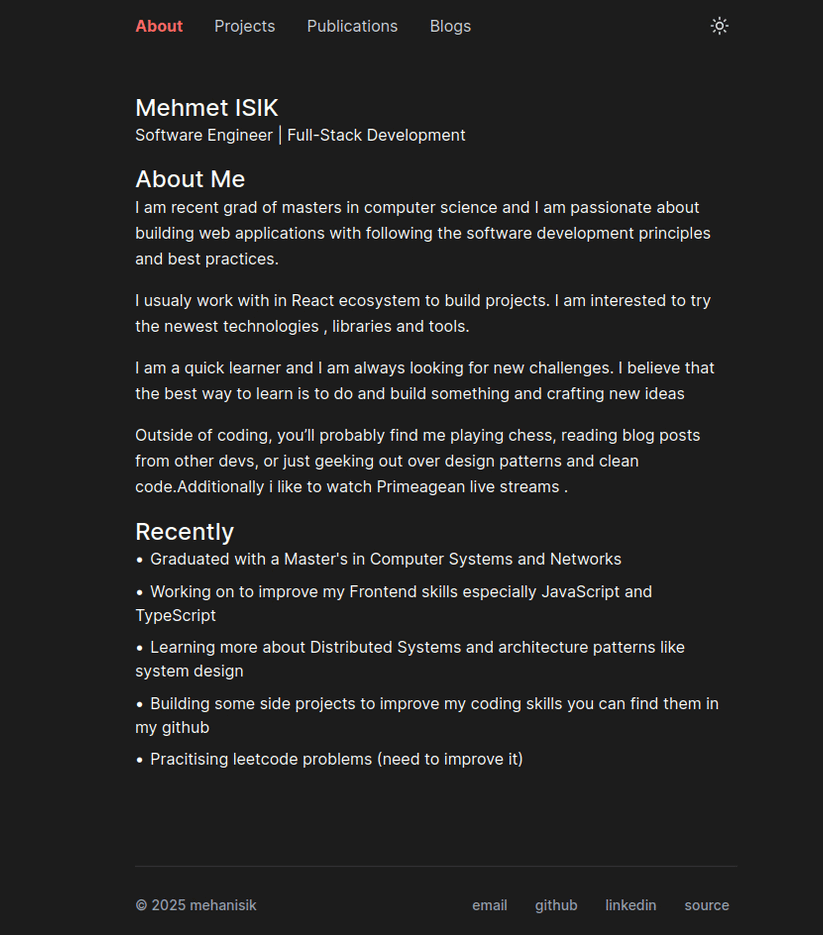

# Blogy

<div align="center">
  
  
  [](https://react.dev/)
  [](https://www.typescriptlang.org/)
  [](https://tailwindcss.com/)
  [](LICENSE)
  [](https://www.netlify.com/)
</div>

<div align="center">
  
</div>

## Overview

A simple, minimalist portfolio and blog website built with React, TanStack Router, and Tailwind CSS. This platform serves as a space for sharing knowledge, experiences, and insights about software development.


## Technology Stack

The website is built using a modern technology stack:
- React 19 with React Compiler
- TanStack Router for type-safe navigation
- Tailwind CSS for styling
- Supabase for backend services
- TypeScript for type safety
- Biome for code quality
- UMAMI for analytics

## Getting Started

### Prerequisites

- Node.js 20 or later
- Bun (recommended) or npm
- Git

### Installation

1. Clone the repository:
   ```bash
   git clone https://github.com/mhanifiisik/blogy.git
   cd blogy
   ```

2. Install dependencies:
   ```bash
   bun install
   ```

3. Configure environment:
   ```bash
   cp .env.example .env.local
   ```
   Update `.env.local` with your Supabase credentials.

4. Start development server:
   ```bash
   bun run dev
   ```

The application will be available at `http://localhost:3000`.

## Project Structure

```
src/
├── components/    # Reusable UI components
├── routes/        # Application routes
├── services/      # API and data services
├── styles/        # Global styles
├── types/         # TypeScript type definitions
├── hooks/         # Custom React hooks
├── constants/     # Application constants
└── db/           # Database configuration
```

## Development

```bash
# Start development server
bun run dev

# Build for production
bun run build

# Preview production build
bun run serve

# Run tests
bun run test

# Lint code
bun run lint

# Format code
bun run format
```

## Deployment

The project is configured for automatic deployment on Netlify. The build process is managed through the `netlify.toml` configuration file.

## Technologies

- [React](https://react.dev/) - UI Library
- [TanStack Router](https://tanstack.com/router) - Type-safe routing
- [Tailwind CSS](https://tailwindcss.com/) - Utility-first CSS
- [Supabase](https://supabase.com/) - Backend as a Service
- [Biome](https://biomejs.dev/) - Linting and formatting
- [UMAMI](https://umami.is/) - Privacy-focused analytics

## License

This project is licensed under the MIT License. See the [LICENSE](LICENSE) file for details.

## Author

Mehmet Hanifi Isik
- GitHub: [@mhanifiisik](https://github.com/mhanifiisik)
